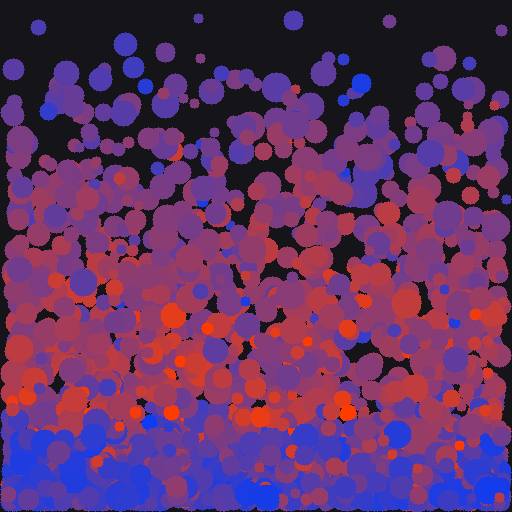
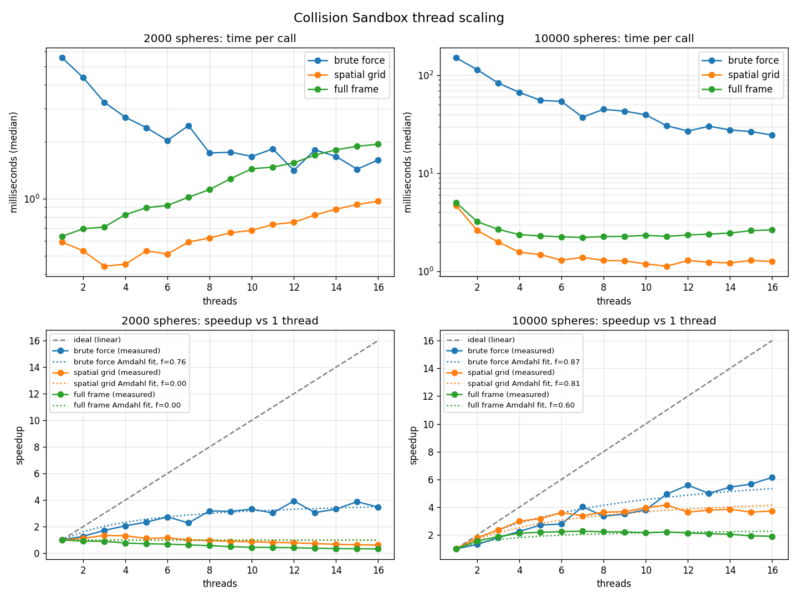

# Collision Sandbox

A small, dependency-free C++17 physics sandbox. A few thousand spheres are dropped
into a box, fall under gravity, and bounce off each other and the walls. The point of
the project is to show the pieces a game physics runtime is made of:

| Piece | Where | What it does |
|---|---|---|
| 3D math | `src/Vec3.h` | Vector add/scale, dot, cross, length, normalize |
| Kinematics | `src/World.cpp` `integrate()` | Semi-implicit Euler integration with gravity |
| Broadphase (naive) | `src/BruteForce.cpp` | O(n²) test of every pair |
| Broadphase (fast) | `src/SpatialGrid.cpp` | Uniform grid, only tests neighbouring cells |
| Narrowphase | `src/Collision.cpp` | Sphere/sphere overlap test, impulse response, wall bounce |
| Parallelism | `src/Parallel.h` | A tiny `parallelFor` built on `std::thread` |
| Output | `src/PpmWriter.cpp` | Writes PPM images so you can see the result |

No libraries beyond the C++ standard library. No CMake. One batch file / shell script.



*Frame 110 of the default run. The spheres have fallen under gravity and piled up at the floor. Colour shows speed: blue is slow, red is fast.*

## Build and run

Windows (needs Visual Studio Build Tools with the C++ workload):

```
build.bat
build\tests.exe
build\collision_sandbox.exe
```

Linux / macOS / MinGW:

```
sh build.sh
./build/tests
./build/collision_sandbox
```

Optional arguments: `collision_sandbox [sphereCount] [frameCount] [threadCount]`

```
build\collision_sandbox.exe 10000 60 8
```

Frames are written to `out/frame_0000.ppm`, `out/frame_0010.ppm`, ... Most image
viewers (IrfanView, GIMP, VS Code with an image extension) open PPM directly.
Blue spheres are slow, red spheres are fast.

## How a frame works

```
integrate()          gravity + move + wall bounce      <- parallel, one slice of spheres per thread
grid.build()         drop each sphere into a grid cell <- serial
grid.findPairs()     find overlapping pairs            <- parallel, one slice of cells per thread
resolveCollisions()  push apart + apply impulses       <- serial
```

### Why the grid is faster

Brute force compares every sphere to every other sphere: n(n-1)/2 tests. With 2000
spheres that is about 2 million tests per frame. The grid divides the box into cubes
the size of one sphere diameter. Two spheres can only touch if they are in the same
cube or in one of the 26 neighbouring cubes, so each sphere is only tested against a
handful of nearby spheres. Work becomes roughly O(n) instead of O(n²).

### How the parallel part stays safe

Threads never write to the same memory:

- `integrate()` gives each thread a contiguous slice of the sphere array. A thread
  only reads and writes spheres in its own slice.
- `findPairs()` gives each thread a slice of grid cells and its **own output vector**.
  The grid itself is read-only while the threads run. The vectors are merged after
  all threads join. No mutex is needed.
- `resolveCollisions()` is deliberately serial. One sphere can be in many pairs, so
  two threads could try to update the same sphere at once. Rather than add locks,
  the pairs are sorted and resolved on one thread.

Sorting the pairs also makes the simulation **deterministic**: 1 thread and 16
threads produce bit-identical results. One of the tests checks this.

### What the numbers show

Run the benchmark and you will see something like:

```
brute force,  1 thread(s):    x ms
brute force, 16 thread(s):    x/8 ms      <- parallelism helps a lot
spatial grid,  1 thread(s):   tiny
spatial grid, 16 thread(s):   sometimes slower than 1 thread!
```

The last line is real. Spawning 16 threads costs tens of microseconds each. If the
total work is under a millisecond, the overhead outweighs the gain. A real engine
would keep a pool of worker threads alive instead of spawning new ones per call.
Try `collision_sandbox 10000` to see the grid parallelism pay off once there is
enough work per frame.

## Thread scaling plot (Python)

`benchmark_threads.py` runs the sandbox at every thread count from 1 to the number
of cores, collects the timings into a pandas DataFrame, and plots measured speedup
against ideal linear scaling and a fitted Amdahl's law curve. Needs only numpy,
pandas and matplotlib.

```
build.bat
py benchmark_threads.py
```

It writes `benchmark_results.csv` and `benchmark_threads.png`.



Measured on an AMD Ryzen 7 2700X (8 cores, 16 threads), Windows 10, MSVC /O2:

| Spheres | Brute force | Spatial grid | Full frame |
|---|---|---|---|
| 2000 | 3.5x | 0.6x | 0.3x |
| 10000 | 6.2x | 3.7x | 1.9x |

*Speedup at 16 threads relative to 1 thread.*

What the plot shows:

- **Top row** is raw time per call on a log scale. **Bottom row** is speedup, with the
  dashed grey line being perfect linear scaling and the dotted lines an Amdahl's law
  fit to each series.
- **Brute force scales best** (about 6x at 10000 spheres) because it has by far the
  most work per call to split up. The fit says roughly 87% of it is parallel.
- **The grid saturates around 4x by 8 threads.** The serial `build()` step and the
  cost of spawning threads every call put a ceiling on it.
- **At 2000 spheres, more threads makes things slower.** Thread creation costs more
  than the sub-millisecond of work being divided. Amdahl's law cannot predict a
  speedup below 1, so the fit reports f = 0 there. The gap between the dotted model
  and the measured points is exactly the thread-spawn overhead a thread pool would
  remove.

## Tests

`tests/test_main.cpp` is a plain `main()` with a `check()` helper. It covers:

- Vec3 math (dot, cross, length, normalize)
- Sphere overlap test, including the exactly-touching edge case
- Collision response conserves momentum and separates the spheres
- Equal-mass elastic head-on collision swaps velocities (classic textbook check)
- Wall bounce clamps position and applies restitution
- Spatial grid finds exactly the same pairs as brute force
- Same pair count on 1 thread vs 4 threads
- Full simulation is deterministic across thread counts

## Things I would do next

- Replace per-call `std::thread` spawning with a persistent thread pool.
- Only visit the 13 "forward" neighbour cells instead of all 26 to halve grid work.
- Add axis-aligned bounding boxes and capsules alongside spheres.
- Continuous collision detection so fast, small spheres cannot tunnel through walls.
- Add rotation (angular velocity, inertia tensor) for full rigid body dynamics.
